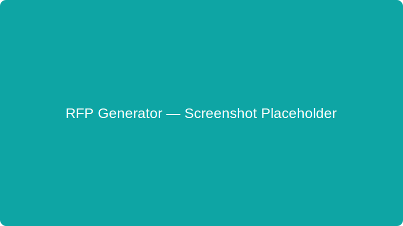

<p align="left">
    
    <a href="https://github.com/Deveshk78/RFP_Generator_agent_bedrock/actions/workflows/ci.yml"></a>
    
    <a href="https://github.com/Deveshk78/RFP_Generator_agent_bedrock/releases"></a>
    <a href="https://github.com/Deveshk78/RFP_Generator_agent_bedrock/actions/workflows/pages.yml"></a>
</p>

# RFP Generator Agent (Amazon Bedrock + DynamoDB)

AI-powered **Request for Proposal (RFP)** generator for software engineering programs across multiple industry domains. Built with **Amazon Bedrock** (Claude), **DynamoDB**, **FastAPI**, and a responsive **Next.js** web UI (Tailwind + shadcn/ui).

**Repository:** [github.com/Deveshk78/RFP_Generator_agent_bedrock](https://github.com/Deveshk78/RFP_Generator_agent_bedrock)

---

## Table of Contents

- [Features](#features)
- [Architecture](#architecture)
- [Industry Domains](#industry-domains)
- [Prerequisites](#prerequisites)
- [Installation](#installation)
- [Configuration](#configuration)
- [Running the Application](#running-the-application)
- [Web UI Guide](#web-ui-guide)
- [CLI Reference](#cli-reference)
- [API Reference](#api-reference)
- [Project Structure](#project-structure)
- [Troubleshooting](#troubleshooting)
- [Security](#security)

---

## Features

| Feature | Description |
|---------|-------------|
| **Domain RFP Generation** | Generate detailed, domain-specific RFP documents via Bedrock |
| **Word Export** | Auto-export formatted `.docx` files with cover page and sections |
| **RFP Analysis** | Extract requirements, compliance checklists, risk matrices, evaluation criteria |
| **Proposal Drafting** | Generate vendor proposal responses from company profile |
| **AI Chat** | Formatted Markdown answers, Mermaid diagrams, voice input |
| **Persistence** | DynamoDB single-table design for RFPs, analysis, proposals, chat history |
| **Responsive UI** | Laptop, tablet, iPhone, and Android layouts (Tailwind + shadcn) |
| **CLI** | Full command-line interface for scripting and automation |

---

## Architecture

```
┌─────────────────────────────────────────────────────────────────┐
│                         User (Browser / CLI)                     │
└────────────────────────────┬────────────────────────────────────┘
                             │
         ┌───────────────────┴───────────────────┐
         ▼                                       ▼
┌─────────────────┐                   ┌─────────────────┐
│  Next.js Web UI │                   │  rfp-agent CLI  │
│  (port 3000)    │                   │  (main.py)      │
└────────┬────────┘                   └────────┬────────┘
         │ /api/* proxy                         │
         ▼                                       ▼
┌─────────────────────────────────────────────────────────────┐
│                    FastAPI Backend (port 8000)                │
└────────┬───────────────────────────────┬────────────────────┘
         ▼                               ▼
┌─────────────────┐             ┌─────────────────┐
│ Amazon Bedrock  │             │   DynamoDB      │
└─────────────────┘             └─────────────────┘
         ▼
┌─────────────────┐
│ output/rfps/    │  ← Generated .docx files
└─────────────────┘
```

### DynamoDB Single-Table Design

| PK | SK | Purpose |
|----|-----|---------|
| `RFP#{uuid}` | `METADATA` | RFP document, title, status, domain |
| `RFP#{uuid}` | `ANALYSIS#{timestamp}` | AI analysis results |
| `RFP#{uuid}` | `PROPOSAL#{timestamp}` | Generated proposals |
| `RFP#{uuid}` | `MSG#{timestamp}` | Chat message history |

---

## Industry Domains

13 pre-built templates: Oil & Gas, Solar, Battery, Wave, Water, Wind, Legal Analytics, Healthcare, Hospitals, Hotels, Trading, Banking, Finance.

---

## Prerequisites

- Python 3.10+
- Node.js 18+ (web UI)
- AWS account with Bedrock + DynamoDB access

---

## Installation

```bash
git clone https://github.com/Deveshk78/RFP_Generator_agent_bedrock.git
cd RFP_Generator_agent_bedrock

python3 -m venv .venv && source .venv/bin/activate
pip install -r requirements.txt

cd web && npm install && cd ..
cp .env.example .env
cp web/.env.local.example web/.env.local
```

---

## Configuration

```env
AWS_ACCESS_KEY_ID=your_access_key
AWS_SECRET_ACCESS_KEY=your_secret_key
AWS_REGION=us-east-1
BEDROCK_MODEL_ID=us.anthropic.claude-sonnet-4-6
BEDROCK_READ_TIMEOUT=600
DYNAMODB_TABLE=RfpAgent
```

---

## Running the Application

```bash
chmod +x start-all.sh start-api.sh start-web.sh rfp-agent
./start-all.sh
```

Open **http://localhost:3000**

---

## Web UI Guide

| Page | Description |
|------|-------------|
| `/` | Domain gallery + recent RFPs |
| `/generate` | Create domain-specific RFP + Word download |
| `/rfp/[id]` | Document, Analysis, Proposal, Chat tabs |

**Chat:** Markdown formatting, Mermaid diagrams, voice input (mic button).

---

## CLI Reference

```bash
./rfp-agent init
./rfp-agent create --title "..." --file samples/rfp.txt
./rfp-agent list
./rfp-agent analyze --rfp-id <uuid>
./rfp-agent propose --rfp-id <uuid> --company "Acme" --profile-file samples/company_profile.txt
./rfp-agent chat --rfp-id <uuid>
```

---

## API Reference

| Method | Endpoint | Description |
|--------|----------|-------------|
| GET | `/api/health` | Health check |
| GET | `/api/domains` | Industry domains |
| GET | `/api/rfps` | List RFPs |
| POST | `/api/rfps/generate` | Generate RFP + docx |
| POST | `/api/rfps/{id}/analyze` | Analyze RFP |
| POST | `/api/rfps/{id}/propose` | Generate proposal |
| POST | `/api/rfps/{id}/chat` | Chat |
| GET | `/api/rfps/{id}/download` | Download .docx |

---

## Project Structure

```
├── api/server.py          # FastAPI backend
├── src/                   # Bedrock agent, DynamoDB, docx export, domains
├── web/                   # Next.js + Tailwind + shadcn UI
├── main.py                # CLI
├── rfp-agent              # CLI launcher
├── start-all.sh           # Run everything
└── samples/               # Sample files
```

---

## Troubleshooting

| Error | Fix |
|-------|-----|
| Load failed | Run `./start-api.sh` |
| Bedrock read timeout | Set `BEDROCK_READ_TIMEOUT=900`, restart API |
| Model not found | Use `us.anthropic.claude-sonnet-4-6` inference profile |

---

## Security

- Never commit `.env` or credentials
- Rotate exposed AWS/GitHub credentials immediately
- Use IAM least-privilege in production

## Admin Review UI, Authentication, and Rate Limiting

This repository now includes a lightweight admin review workflow and improvements for production readiness.

- Admin UI
    - A Next.js page is available at `web/app/admin/needs-review/page.tsx`. It calls the backend endpoint `GET /api/admin/needs-review` and displays RFPs marked with `needs_review`.
    - Approvers can click Approve which calls `POST /api/admin/approve/{rfp_id}`. The client sends an optional `x-approver` header which is recorded.
    - The UI expects an API token (client-side) stored in `localStorage` under the key `apiToken` for the current demo implementation. For production use, the UI should use proper authentication flows (OIDC/OAuth) and pass a JWT in the Authorization header.

- Authentication (JWT + backward-compatible tokens)
    - The backend now supports JWT validation (preferred) and falls back to static tokens for backward compatibility.
    - Environment variables:
        - `JWT_PUBLIC_KEY` — RSA public key for RS256-signed JWTs (preferred)
        - `JWT_SECRET` — HMAC secret for HS256-signed JWTs (alternative)
        - `JWT_ALGORITHM` — algorithm to validate (default: RS256)
        - `VALID_TOKENS` — comma-separated token[:role] entries for legacy setups (e.g. `token1:admin,token2:reviewer`). If `VALID_TOKENS` is set and JWT is not provided, the middleware requires a token.
    - JWTs should contain a `role` claim (`admin` or `reviewer`) so the approve endpoint can enforce role-based access.

- Rate limiting (Redis-backed recommended)
    - The middleware enforces per-token (or per-IP) rate limits. By default this is an in-memory limiter (`RATE_LIMIT_PER_MINUTE`, default 120). For multi-instance deployments use Redis:
        - Set `REDIS_URL` to enable Redis-backed sliding-window rate limiting.
        - The middleware stores recent request timestamps in a Redis sorted set per token/key.

- Audit trail
    - Approvals and review actions are persisted as `REVIEW#<timestamp>` items in the DynamoDB table via `DynamoDBStore.record_review()`.
    - Metadata `METADATA` item is updated with `reviewed_by` and `reviewed_at` fields when a review is recorded.

- Running locally (tests)
    - This project uses a virtual environment under `.venv/` for local dev. To install dependencies and run the tests:

```bash
# create virtualenv (if you don't have .venv)
python3 -m venv .venv
source .venv/bin/activate
pip install -r requirements.txt
# run all tests
.venv/bin/python -m pytest -q
```

    - The new tests include `tests/test_admin_approve.py` which validates the approve endpoint role enforcement and a small rate-limiting behavior. The tests mock the store to avoid AWS calls.

---

**Author:** [Deveshk78](https://github.com/Deveshk78)

## AI Agent Compliance

One-liner: I inspected the codebase and confirmed this repository implements a focused AI Agent for building, analyzing, and responding to RFPs — below I list the concrete parameters and code evidence that certify it as an RFP builder agent, the agent contract (inputs/outputs/fail modes), edge cases, gaps, and recommended next steps I can implement for you.

Short answer
Yes — this project is an AI Agent specialized for RFP (Request for Proposal) generation and related tasks. It is a request-driven agent (invoked by CLI/API), not an autonomous, long-running planner. It orchestrates LLM calls, stores state, exports artifacts, and supports conversational interactions — everything required for an RFP builder agent.

Concrete evidence / certifying parameters (with code locations)
Model integration (LLM runtime)

- Uses Amazon Bedrock via boto3 Bedrock Runtime client in `src/bedrock_agent.py` (self._client = boto3.client("bedrock-runtime")). This is the core LLM integration.
- Model selection via settings: `settings.bedrock_model_id` → direct model control.
Agent role & system prompts (defines agent behavior)

- `SYSTEM_PROMPT`, `ANALYSIS_SYSTEM_PROMPT`, `CHAT_SYSTEM_PROMPT` in `src/bedrock_agent.py` — explicitly set agent persona and required output formatting (Markdown, headings, tables, mermaid). These prompts guarantee domain-appropriate behavior and structured outputs.
Core agent methods (capabilities)

- `generate_rfp_document(...)` — produces a full RFP (minimum 3,000 words, explicit section structure).
- `analyze_rfp(title, content)` — produces a structured RFP analysis (requirements, risks, evaluation criteria).
- `generate_proposal(...)` — returns a vendor proposal draft given a company profile.
- `chat_about_rfp(...)` — conversational Q&A using RFP context and history.
- Evidence: methods implemented with structured prompts and call `_converse()` (LLM wrapper).
API endpoints and automation surfaces

- FastAPI endpoints in `api/server.py` map directly to agent features:
    - `POST /api/rfps/generate` → generate RFP
    - `POST /api/rfps/{id}/analyze` → analyze
    - `POST /api/rfps/{id}/propose` → propose
    - `POST /api/rfps/{id}/chat` → chat
    - `GET /api/rfps/{id}/download` → docx export
- CLI in `main.py` exposes the same actions (`create`, `analyze`, `propose`, `chat`, `init`).
Persistence and state (essential for agent workflows)

- `dynamodb_store.py` implements a single-table design for RFP metadata, analyses, proposals, and chat messages (PK = RFP#{uuid}, SK prefixes like `ANALYSIS#`, `PROPOSAL#`, `MSG#`). This stores artifact history and allows continuation.
Artifact export and delivery

- `docx_export.py` produces Word (.docx) output with a cover page and formatted sections — required for an RFP product.
Domain knowledge and templating

- `domains.py` includes 13+ industry domain templates (Oil & Gas, Solar, Healthcare, Banking, etc.) with compliance and typical systems — used to tailor generated RFPs.
Context management and safety controls

- `_truncate()` and `MAX_CONTEXT_CHARS` in `src/bedrock_agent.py` limit prompt length; `Config(read_timeout=...)` sets timeouts; `inferenceConfig` sets `temperature` and `maxTokens` — these are operational parameters controlling LLM behavior.
Conversational history

- Chat history saved & retrieved via `DynamoDBStore.save_message()` and `get_chat_history()` and passed back into `chat_about_rfp()`.
CI / docs / operations

- GitHub workflows for CI and Pages, docs in `docs/` and a Release workflow were added earlier — helpful for productization and compliance.
Minimal “Agent contract”
- Inputs:
    - For generation: title, domain_id, organization, project_summary, budget_range, timeline.
    - For analysis: rfp_id (reads stored content).
    - For proposal: rfp_id + company profile (text or file).
    - For chat: rfp_id + message.
- Outputs:
    - RFP document (Markdown string) and .docx file.
    - Analysis (Markdown with sections/tables).
    - Proposal (Markdown).
    - Chat replies (Markdown).
- Error modes:
    - Bedrock returns empty/partial → code raises RuntimeError/HTTP 500.
    - Missing AWS credentials or DynamoDB table errors on startup.
    - Invalid domain_id → 400 response.
    - Very large content → truncated context (explicit truncation behavior).
- Success criteria:
    - Non-empty, structured Markdown output (required headings/tables).
    - Document stored in DynamoDB and .docx present in `output/rfps/`.
    - Analysis & proposal items saved with SK timestamps and retrievable.
Likely edge cases and how the repo handles them
- Long RFPs exceeding model context → safe truncation via `_truncate()` (keeps head/tail).
- Bedrock timeouts or empty responses → handled by raising (read_timeout set in client config and runtime checks for empty responses).
- DynamoDB missing table → `ensure_table()` attempts create and waits.
- Inconsistent/formatless LLM output (hallucination, missing required sections) → currently not validated; the prompts strongly instruct structure but there’s no post-assertion step.
Gaps & recommended improvements (concrete)
These are things that would increase certification/confidence for production RFP-agent behavior.

Output validation / schema enforcement (high priority)

- Add a validator that verifies generated RFP/analysis/proposal includes required headings & tables. If missing, re-run or flag for human review.
- Implement JSON/YAML extraction option (LLM returns a structured JSON alongside Markdown), validated with JSON Schema.
Automated unit/integration tests (high value)

- Add unit tests for `BedrockAgent` using a mocked Bedrock client to assert prompts, truncation, and retry behavior.
- Add integration smoke tests for API endpoints (mocked AWS).
Hallucination controls & fact-checking

- Add a verification pass that cross-checks extracted facts (deadlines, mandatory items) against the RFP text.
- Add domain-specific rules (e.g., mandatory compliance items must be present or explicitly marked as N/A).
Security / operational hardening

- Implement API auth (JWT/OPA) and role-based access for proposals/doc downloads.
- Add request rate limiting and quota controls.
- Add content-moderation checks or safe-completion policies.
Observability & auditability

- Add structured logging (including prompt + model response hash), metrics (latency, success/failure), and tracing.
- Persist model response metadata (tokens used, model id, temperature).
Human-in-the-loop workflow

- Add a “review queue” where generated RFPs/analyses are approved before publishing/issuing.
Use an Agent framework (optional)

- Consider integrating a small orchestration layer (LangChain/semantic-kernel) for composability and planning if you need multi-step action sequences (e.g., iterative RFP refinement with sub-tasks).
Quick checklist mapping to “RFP builder agent” criteria
- LLM integration for content generation — Done (Bedrock).
- Domain templates/knowledge — Done (`domains.py`).
- Analysis & proposal generation — Done (`analyze_rfp`, `generate_proposal`).
- Conversational interface with history — Done (chat endpoints + DynamoDB messages).
- Persistence of artifacts & history — Done (DynamoDB single-table).
- Export to final deliverable (.docx) — Done (`docx_export.py`).
- API + CLI interfaces for automation — Done (`server.py`, `main.py`).
- Structured prompts enforcing output format — Done (system prompts).
- Output schema validation / human review — Deferred (recommend to add).
Small risk summary
- Hallucination and missing required sections are possible because there is no automated schema validation or fact-checking after the model returns content.
- Running in production requires secure AWS credential handling (use IAM roles/encryption) and audit logging.
Suggested next concrete tasks I can implement now (pick 1–2)
- Add JSON schema validator and a wrapper that runs after each generation/analysis/proposal to verify required headings (I can implement and run unit tests).
- Add unit tests for BedrockAgent mocking the Bedrock client and verifying prompt contents and fallback behavior.
- Add an automated “post-generation sanity check” that asserts presence of these headings: Introduction, Scope, Deliverables, Evaluation Criteria, Submission Instructions; if any missing, mark item `needs_review`.
- Add simple API auth middleware (token-based) to protect endpoints.
Which of these should I implement first? If you want, I’ll start by adding a post-generation validator (code + tests) and wire it into `api/server.py` so generated RFPs are automatically validated and flagged for human review when incomplete.

## Notes & Suggestions

Operational notes:

- For production deployments, use a managed cache (Redis or DynamoDB with TTL) for rate-limiting counters instead of the in-memory approach used in development.
- Configure `API_KEY` (legacy) and `VALID_TOKENS` (comma-separated) environment variables for lifecycle management of service tokens; prefer rotating tokens via your secrets manager.
- Persist model response metadata (model id, temperature, tokens used) for auditing and cost analysis.

Product suggestions:

- Have the model return both structured JSON and Markdown (the implementation below requests JSON+Markdown) — JSON is validated and used to populate the RFP schema, Markdown is the human-readable artifact.
- Add an admin UI (protected by token auth) to review RFPs flagged `needs_review`, approve them, and optionally re-run generation with targeted prompts.
- Consider a human-in-the-loop review queue where generated RFPs remain `needs_review` until a reviewer approves.

Security & compliance:

- Use IAM roles for the API server in cloud deployments (avoid embedded AWS keys).
- Store `VALID_TOKENS` or other secrets in a secret manager and rotate regularly.
- Use HTTPS and enforce secure headers on the web UI and API.

## Screenshots

Quick preview (placeholders). Replace these with real screenshots by saving under `assets/screenshots/`:




## Quick start (summary)

1. Create a Python virtualenv and install deps:

```bash
python3 -m venv .venv
source .venv/bin/activate
pip install -r requirements.txt
```

2. Install web deps:

```bash
cd web && npm install && cd ..
```

3. Decode PNG icons (optional):

```bash
./scripts/decode-icons.sh
```

4. Start backend and web UI (development):

```bash
./start-api.sh
./start-web.sh
```

Visit the Docs site (when deployed) at: https://deveshk78.github.io/RFP_Generator_agent_bedrock (or check the Pages badge above).
